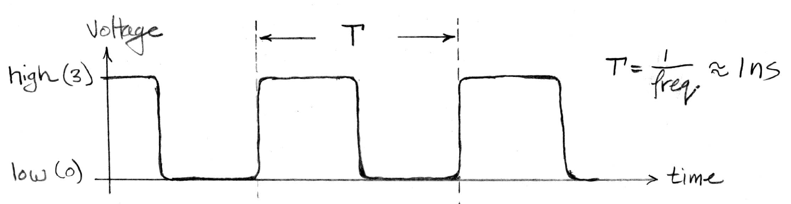

# Introduction to States Hello
 
The goal for this section is:

- Understand waveform diagram of the clock signal
- Identity the propagation delay of a combinational logic circuit

Processing chips are composed of wires and transistors 
among other things. All of these components are printed onto a 
motherboard where electricity flows. The energy on the motherboard
is used to move eletric charge from place to place in the circuits
and in the process is dissipated as heat.

State refers to a circuit that store information. If a circuit 
output depends on current inputs and past history that is 
considered a state circuit. 

A reason why we are talking about processing chips in the first part
is to illustrate that chips are made on state and combinational 
logic circuits.

## The Clock

The clock input signal is a special connection that connects to a 
chip (CPU chip, GPU chip etc). 

The clock signal is the heartbeat of the system, it contols the 
timing of the flow of electric charge. Think of the flow of 
electric charges as information.

