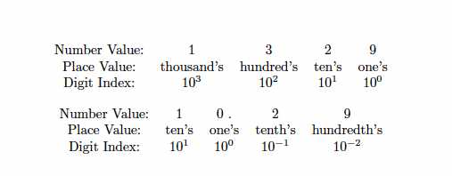

# Using Decimal Numbers

## The method (Decimal * Number)
**METHOD ONE.** THE MOST EFFECTIVE METHOD. 

We want 
$$
1.8 * 8
$$

Ignore the decimal point for now

$$
18 * 8 = 144
$$

Then because there is a number 8 in the tenth's place, you will move one decimal place to the left 
$$
144 = 14.4 (answer)
$$

**METHOD TWO.** THE MONKEY EFFECTIVE METHOD.

We want 
$$
3.212 * 25
$$

We know that
$$
25 = 10 + 10 + 5
$$

Then, using distrubtion -> 3.212(10 + 10 + 5)
$$
\begin{aligned}
&\text{Step one: 3.212 * 10 = 32.12} \\
&\text{Step two: 3.212 * 10 = 32.12} \\
&\text{Step three: 3.212 * 5 = 16.060}
\end{aligned}
$$

We add all of them
$$
32.12 + 32.12 + 16.06 = 80.3(answer)
$$

### Examples
1. 1.8 * 23 = 18 * 23 = 41.4
2. 5.59 * 10 = 55.9
3. 5.59 * 100 = 559
